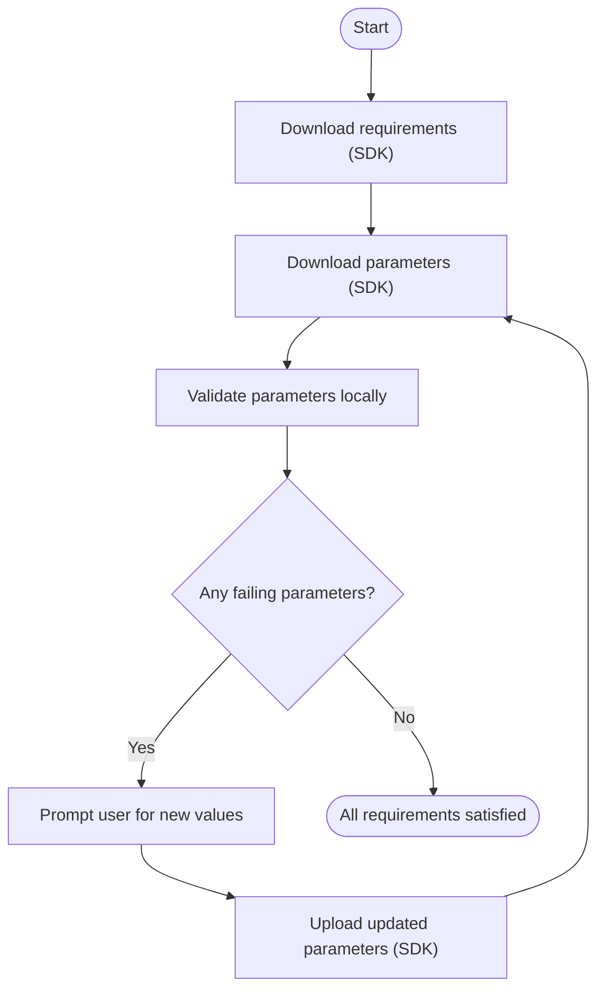
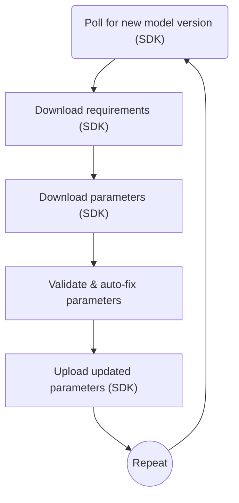
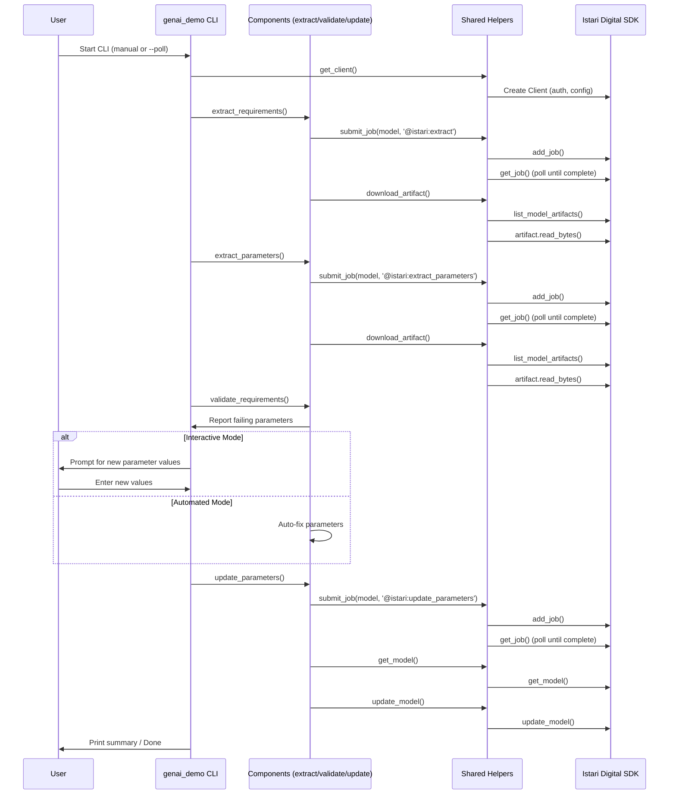

# GenAI Demo: CAD/CAM Model Requirements & Parameters CLI

A modern CLI for extracting, validating, and updating CAD/CAM model requirements and parameters using the Istari Digital SDK.

---

## ✨ Features

- **Extract requirements/parameters** from remote models
- **Validate** CAD parameters against system requirements
- **Update** parameters (auto or manual) and push to the model
- **Automated polling** for CI/CD or integration workflows
- **Interactive/manual mode** for guided parameter fixing

---

## 🚀 Quick Start

```sh
# Install dependencies
poetry install

# Run interactively (manual mode)
python -m genai_demo

# Run in automated polling mode
python -m genai_demo --poll

# Enable debug logging (works with any mode)
python -m genai_demo --debug
python -m genai_demo --poll --debug
```

---

## 🏗️ Architecture Overview

```
genai_demo/
├── __main__.py         # CLI entry point: interactive & automated workflows
├── components/
│   ├── extract_requirements.py   # Extracts requirements via SDK job
│   ├── extract_parameters.py     # Extracts parameters via SDK job
│   ├── update_parameters.py      # Updates parameters via SDK job
│   └── validate_requirements.py  # Validates & auto-fixes parameters
├── shared/
│   ├── helpers.py      # All SDK and file IO helpers
│   └── constants.py    # Model IDs, artifact names, env config
```

---

## 🛠️ How the CLI Works with the Istari Digital SDK

This CLI streamlines the process of managing CAD/CAM model requirements and parameters by leveraging the Istari Digital SDK for all remote operations. Here's how it works under the hood:

### Main Workflows

#### 1. **Interactive Mode**

- **Purpose:** Guides users through fixing parameter issues until all requirements are satisfied.
- **How it works:**
  1. **Download requirements** from the remote model using the SDK.
  2. **Download parameters** from the CAD model.
  3. **Validate** parameters locally against requirements.
  4. **Prompt the user** to update any failing parameters (with units).
  5. **Upload changes** back to the model if updates are made.
  6. **Repeat** until all requirements are satisfied.

#### 2. **Automated Mode** (`--poll`)

- **Purpose:** Automatically monitors for new model versions and fixes parameter issues without user input.
- **How it works:**
  1. **Polls for new versions** of the model using the SDK.
  2. **Downloads, validates, and auto-fixes** requirements and parameters.
  3. **Uploads fixed parameters** to the model.
  4. **Repeats** for continuous integration scenarios.

### How the CLI Uses the Istari Digital SDK

- **Client Setup:**
  - The CLI creates a `Client` object using environment variables for the registry URL and authentication token.
- **Job Submission:**
  - To extract requirements or parameters, or to update parameters, the CLI submits jobs to the remote model using `Client.add_job`.
- **Job Monitoring:**
  - The CLI polls job status using `Client.get_job` until the job is complete or fails.
- **Artifact Download:**
  - After a job completes, the CLI lists available artifacts using `Client.list_model_artifacts` and downloads the relevant artifact using `read_bytes()`.
- **Model Update:**
  - When parameters are updated, the CLI downloads the current model file using `Client.get_model` and `mod.file.read_bytes()`, then uploads the updated file back to the model using `Client.update_model`.
- **Parameter Validation:**
  - All validation and fixing of parameters is done locally, using the downloaded JSON files and Python logic.

### Example Flow

**User runs:**

```sh
python -m genai_demo
```

**The CLI will:**

1. Use the SDK to download the latest requirements and parameters.
2. Validate parameters locally.
3. If needed, prompt the user for new values.
4. Use the SDK to upload updated parameters to the model.
5. Repeat until all requirements are satisfied.

This approach ensures a seamless, automated, and user-friendly experience for both technical and non-technical users, while leveraging the full power of the Istari Digital SDK for all remote operations.

---

## 🔄 Program Flow Diagrams

The following diagrams illustrate the step-by-step flow for both interactive and automated modes:

### Interactive Mode



### Automated Mode (`--poll`)



---

## 📋 Sequence Diagram: End-to-End Operation

This sequence diagram shows the interactions between the user, CLI, components, helpers, and the Istari Digital SDK during a typical run:



---

## 🧩 How It Works

### 1. **Interactive Mode**

- Downloads requirements and parameters artifacts from remote models
- Validates parameters against requirements
- Prompts user to update failing parameters (with units)
- Pushes updates to the model until all requirements are satisfied

### 2. **Automated Mode** (`--poll`)

- Polls for new model versions
- Automatically fixes and updates parameters as needed
- Runs in a loop for integration/CI scenarios

---

## 🔗 Istari Digital SDK Touchpoints

- **Client creation:**
  - `get_client()` (uses env vars for registry URL and auth token)
- **Job submission:**
  - `Client.add_job` (via `submit_job` helper)
- **Job polling:**
  - `Client.get_job` (via `wait_for_job` helper)
- **Model operations:**
  - `Client.get_model`, `Client.update_model`
- **Artifact operations:**
  - `Client.list_model_artifacts`, artifact download via `read_bytes()`

---

## 🧪 Testing & Coverage

Run all tests and measure coverage:

```sh
poetry run pytest --cov=genai_demo
```

- Tests maximize code coverage by patching all network, file, and user input boundaries.

---

## ⚙️ Configuration

- Set environment variables for registry URL, auth token, and model IDs (see `shared/constants.py`).
- File names for requirements and parameters are also defined in `shared/constants.py`.

---

## 🆘 Troubleshooting

- **Missing modules?** Ensure your Python path and virtual environment are set up.
- **Dependency issues?** Run `poetry install` to resolve.
- **Client/API config?** Check your environment variables.

---

## 📄 License

(Include license information here)

---

## 👩‍💻 Contributing

Pull requests and issues are welcome! See [CONTRIBUTING.md] if available.

---

## ⚙️ CLI Flags

- `--poll`  
  Run in automated polling mode (CI/CD, integration, or batch workflows).
- `--debug`  
  Enable debug logging. Prints extra information about program flow and internal state for troubleshooting.
